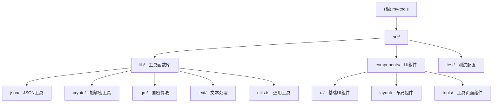

# 开发者工具应用 (Developer Tools)

> 最后更新：2026-02-28 17:46:07

## 项目愿景

一个基于 TDD (测试驱动开发) 方法论构建的现代化开发者工具集合，采用纯前端实现保护用户隐私。提供 JSON 格式化、加解密、国密算法、文本处理等实用工具，遵循 SOLID、KISS、DRY、YAGNI 设计原则。

## 架构总览

**技术栈：**
- **前端框架：** React 18 + TypeScript
- **构建工具：** Vite 5.x
- **UI 组件：** Tailwind CSS + 自定义组件（参考 shadcn/ui 设计）
- **状态管理：** Zustand
- **路由：** React Router DOM v6
- **测试框架：** Vitest + React Testing Library
- **加密库：** crypto-js、js-base64、sm-crypto

**开发模式：**
- 严格遵循 **RED → GREEN → REFACTOR** TDD 循环
- 目标测试覆盖率：80%+
- 所有数据处理在本地进行，不发送任何数据到服务器

## 模块结构图



## 模块索引

| 模块路径 | 职责 | 测试覆盖 | 状态 |
|---------|------|---------|------|
| [src/lib/json](./src/lib/json/CLAUDE.md) | JSON 格式化、验证、压缩、自动修复 | 89.62% | ✅ 完成 |
| [src/lib/crypto](./src/lib/crypto/CLAUDE.md) | Base64、哈希、AES 加解密 | 77.95% | ✅ 完成 |
| [src/lib/gm](./src/lib/gm/CLAUDE.md) | 国密 SM2/SM3/SM4 算法 | 有测试 | ✅ 完成 |
| [src/lib/text](./src/lib/text/CLAUDE.md) | 文本大小写、去重、统计 | 有测试 | ✅ 完成 |
| [src/lib/utils.ts](./src/lib/CLAUDE.md) | 通用工具函数 | 100% | ✅ 完成 |
| [src/components](./src/components/CLAUDE.md) | UI 组件和页面组件 | - | ✅ 完成 |

## 运行与开发

### 开发命令

```bash
# 安装依赖
npm install

# 开发模式（热更新）
npm run dev

# 构建生产版本
npm run build

# 预览构建结果
npm run preview
```

### 测试命令

```bash
# 运行所有测试
npm test

# 测试 UI 界面
npm run test:ui

# 生成覆盖率报告
npm run test:coverage
```

### 代码质量

```bash
# ESLint 检查
npm run lint

# Prettier 格式化
npm run format
```

## 测试策略

### 测试框架配置
- **Vitest** 作为测试运行器
- **React Testing Library** 用于组件测试
- **jsdom** 模拟浏览器环境
- **@vitest/coverage-v8** 提供覆盖率报告

### 测试结构
```
src/
├── lib/
│   ├── json/
│   │   ├── index.ts
│   │   ├── json.test.ts        # 单元测试
│   │   └── types.ts
│   ├── crypto/
│   │   ├── index.ts
│   │   ├── crypto.test.ts      # 单元测试
│   │   └── types.ts
│   └── utils.ts
│   └── utils.test.ts           # 单元测试
└── test/
    └── setup.ts                # 测试全局配置
```

### 当前测试覆盖率

| 模块 | 语句覆盖 | 分支覆盖 | 函数覆盖 | 行覆盖 |
|------|---------|---------|---------|--------|
| utils.ts | 100% | 100% | 100% | 100% |
| json/ | 89.62% | 80% | 85.71% | 89.62% |
| crypto/ | 77.95% | 63.04% | 100% | 77.95% |
| **总体** | **76.02%** | - | - | - |

### TDD 开发流程

1. **RED** - 先编写失败的测试用例
2. **GREEN** - 实现最小代码使测试通过
3. **REFACTOR** - 重构改进代码质量
4. **覆盖** - 确保达到 80%+ 测试覆盖率

## 编码规范

### TypeScript 规范
- 使用严格模式：`strict: true`
- 优先使用 `interface` 定义对象类型
- 使用类型别名定义联合类型
- 避免使用 `any`，优先使用 `unknown`

### 命名规范
- **文件名：** camelCase（组件 PascalCase）
- **变量/函数：** camelCase
- **类型/接口：** PascalCase
- **常量：** UPPER_SNAKE_CASE
- **测试文件：** `*.test.ts` 或 `*.spec.ts`

### 组件规范
- 函数式组件 + Hooks
- 使用 TypeScript 定义 Props 类型
- 组件文件大写 PascalCase（如 `JsonFormatter.tsx`）

### 导入顺序
1. React 相关
2. 第三方库
3. 绝对路径导入（@/ 别名）
4. 相对路径导入
5. 类型导入（如有）

```typescript
import { useState } from 'react'
import { Link } from 'react-router-dom'
import { Card } from '@/components/ui/Card'
import { formatJson } from '@/lib/json'
import { LocalComponent } from './LocalComponent'
```

## AI 使用指引

### 开发新功能时的提示词模板

**1. 添加新工具函数（TDD 流程）**
```
请遵循 TDD 流程为 src/lib/[module]/ 添加 [功能名称]：
1. 先编写测试用例（RED）
2. 实现功能代码（GREEN）
3. 重构优化代码（REFACTOR）
4. 确保覆盖率达到 80%+

功能需求：
- [具体需求描述]
- [输入输出示例]
```

**2. 创建新工具页面组件**
```
请创建新工具页面组件 src/components/tools/[ToolName].tsx：
- 使用现有的 UI 组件（Card, Button, Textarea 等）
- 复用 JsonFormatter.tsx 的布局结构
- 集成 src/lib/[module]/ 的工具函数
- 添加错误处理和用户反馈
- 路由路径：/[path]
```

**3. 运行测试并修复**
```
请运行 npm test 并：
1. 查看失败的测试用例
2. 修复代码使测试通过
3. 运行 npm run test:coverage 检查覆盖率
4. 如果覆盖率 < 80%，补充测试用例
```

### 关键设计原则

**SOLID 原则：**
- **S**ingle Responsibility：每个函数/组件只做一件事
- **O**pen/Closed：通过函数组合扩展功能，而非修改现有代码
- **L**iskov Substitution：子类型可替换父类型
- **I**nterface Segregation：接口专一，不强制依赖不需要的方法
- **D**ependency Inversion：依赖抽象而非具体实现

**其他原则：**
- **KISS：** 保持简单直接
- **DRY：** 避免代码重复，提取公共逻辑
- **YAGNI：** 只实现当前需要的功能

### 代码审查检查清单

- [ ] 是否有对应的测试用例？
- [ ] 测试覆盖率是否达到 80%+？
- [ ] 是否遵循 TypeScript 严格模式？
- [ ] 是否处理了错误情况？
- [ ] 是否使用了正确的类型定义？
- [ ] 是否遵循命名规范？
- [ ] 是否有必要的注释说明复杂逻辑？
- [ ] 是否通过了 `npm run lint` 检查？

## 项目结构

```
my-tools/
├── src/
│   ├── lib/                    # 工具函数库（核心业务逻辑）
│   │   ├── json/               # JSON 工具
│   │   ├── crypto/             # 加解密工具
│   │   ├── gm/                 # 国密算法
│   │   ├── text/               # 文本处理工具
│   │   └── utils.ts            # 通用工具函数
│   ├── components/             # React 组件
│   │   ├── ui/                 # 基础 UI 组件
│   │   ├── layout/             # 布局组件
│   │   └── tools/              # 工具页面组件
│   ├── test/                   # 测试配置
│   ├── App.tsx                 # 应用入口
│   └── main.tsx                # React 挂载
├── public/                     # 静态资源
├── coverage/                   # 测试覆盖率报告
├── package.json                # 项目配置
├── vite.config.ts              # Vite 配置
├── tsconfig.json               # TypeScript 配置
├── tailwind.config.js          # Tailwind 配置
├── IMPLEMENTATION_PLAN.md      # 实施计划
└── README.md                   # 项目说明
```

## 路由结构

| 路径 | 组件 | 说明 |
|------|------|------|
| `/` | `Home` | 工具导航首页 |
| `/json` | `JsonFormatter` | JSON 格式化工具 |
| `/crypto` | `CryptoTools` | 加解密工具 |

## 常见问题

### Q: 如何添加新的工具模块？

1. 在 `src/lib/` 下创建新目录（如 `src/lib/encoder/`）
2. 编写工具函数（`index.ts`）和类型定义（`types.ts`）
3. 先编写测试文件（`*.test.ts`），遵循 TDD 流程
4. 在 `src/components/tools/` 创建对应的 UI 组件
5. 在 `src/App.tsx` 添加路由

### Q: 测试失败时如何调试？

```bash
# 运行特定测试文件
npm test -- json.test.ts

# 运行测试 UI（可视化调试）
npm run test:ui

# 查看覆盖率详情
npm run test:coverage
# 然后打开 coverage/index.html
```

### Q: 如何查看代码覆盖率？

运行 `npm run test:coverage` 后，查看：
- 终端输出的文本报告
- `coverage/index.html`（可视化 HTML 报告）

### Q: 国密算法的使用限制？

国密算法（SM2/SM3/SM4）仅供学习使用：
- SM2：椭圆曲线公钥密码（签名、加密）
- SM3：密码杂凑算法
- SM4：分组密码算法

密钥格式要求：
- SM2 公钥：64 字符十六进制字符串（不含前缀）
- SM2 私钥：64 字符十六进制字符串
- SM4 密钥：32 字符十六进制字符串（128 位）

## 变更记录

### 2026-02-28 17:46:07
- 初始化 AI 上下文文档
- 生成根级和模块级 CLAUDE.md
- 创建 Mermaid 模块结构图
- 记录项目架构、测试策略、编码规范
- 文档覆盖率：100%（所有核心模块已记录）
